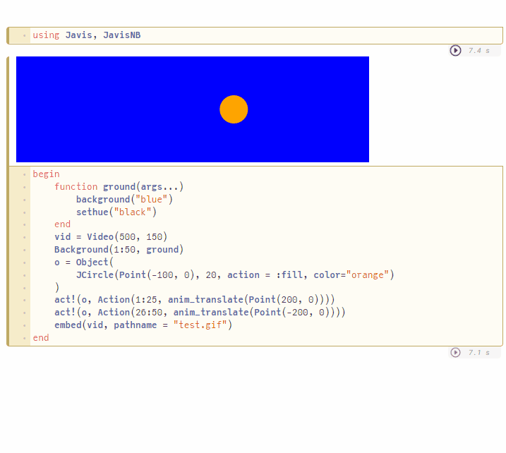
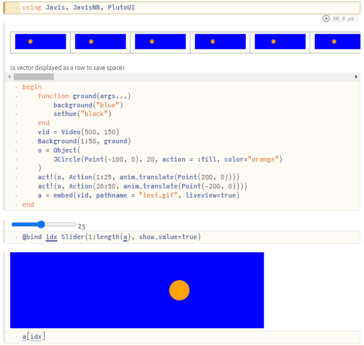
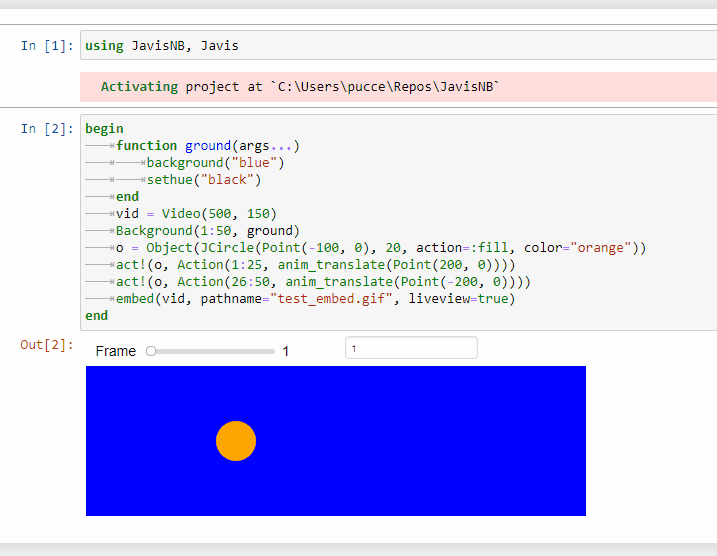

# JavisNB

## How to use JavisNB

`JavisNB` is a small package for use [Javis.jl](https://juliaanimators.github.io/Javis.jl/stable/) within Jupyter and Pluto notebooks.

It is very straightforward to use.
First write all your code for an animation just like you would with `Javis` and then replace `Javis.render` with `JavisNB.embed`.
Alongside sending the rendered animation to a file, the gif will be shown in the notebook.

The `liveview` argument that in `Javis.render` would activate the Javis Live Viewer tool is available in `JavisNB.embed` as well but works differently.
In `Pluto` it returns an array of the frames composing a gif.
In `Jupyter` it creates an interactive view of the animation and lets you scroll through the frames of the gif.


## Pluto

You will need to use two packages:

- [**Pluto**](https://github.com/fonsp/Pluto.jl) - simple reactive notebooks for Julia

- [**PlutoUI**](https://github.com/fonsp/PlutoUI.jl) - enables the creation of widgets in Pluto notebooks

To install these packages, run the following in your Julia REPL:

```julia
] add Pluto, PlutoUI
```

After adding the packages run:

```julia
using Pluto
Pluto.run()
```

Now you should have a working `Pluto` environment. For more information about `Pluto` check the package [home page](https://github.com/fonsp/Pluto.jl).

Once `Pluto` is running one can easily use `Javis` within a notebook using `embed` in place of `render`:



Copy and paste each of the code blocks into different cells

```julia
# Top cell
using JavisNB, Javis

# Bottom cell
begin
    function ground(args...)
        background("blue")
        sethue("black")
    end
    vid = Video(500, 150)
    Background(1:50, ground)
    o = Object(JCircle(Point(-100, 0), 20, action = :fill, color = "orange"))
    act!(o, Action(1:25, anim_translate(Point(200, 0))))
    act!(o, Action(26:50, anim_translate(Point(-200, 0))))
    a = embed(vid, pathname = "test.gif")
end
```

One can also have the animation returned as an array of frames 
to work on it more carefully, this is done setting `liveview=true`.
Together with `PlutoUI` this allows an interactive interface: 



Copy and paste each of the code blocks into different cells

```julia
# Cell 1
using JavisNB, Javis, PlutoUI

# Cell 2
begin
    function ground(args...)
        background("blue")
        sethue("black")
    end
    vid = Video(500, 150)
    Background(1:50, ground)
    o = Object(JCircle(Point(-100, 0), 20, action = :fill, color = "orange"))
    act!(o, Action(1:25, anim_translate(Point(200, 0))))
    act!(o, Action(26:50, anim_translate(Point(-200, 0))))
    a = embed(vid, pathname = "test.gif", liveview = true)
end

# Cell 3
@bind idx Slider(1:length(a), show_value=true)

# Cell 4
a[idx]
```

## Jupyter

You will need to use one package:

- [IJulia](https://julialang.github.io/IJulia.jl/stable/)

To install it run the following in the Julia REPL
```julia
] add IJulia
```
After the package is installed type
```julia
using IJulia
notebook()
```

You should now have a running `Jupyter` notebook. If that is not the case check the `IJulia` [documentation](https://julialang.github.io/IJulia.jl/stable/) for possible solutions.

To make the Jupyter Notebook experience with Javis as easy as possible, 
calling `embed` to render a gif will directly show the video 
as `MIME` element in the notebook as seen below: 


Copy and paste each of the code blocks into different cells

```julia
# Top cell
using JavisNB, Javis

# Bottom cell
begin
    function ground(args...)
        background("blue")
        sethue("black")
    end
    vid = Video(500, 150)
    Background(1:50, ground)
    o = Object(JCircle(Point(-100, 0), 20, action = :fill, color = "orange"))
    act!(o, Action(1:25, anim_translate(Point(200, 0))))
    act!(o, Action(26:50, anim_translate(Point(-200, 0))))
    a = embed(vid, pathname = "test.gif")
end
```

Javis supports a minimal version of the Javis viewer using the [Interact.jl](https://github.com/JuliaGizmos/Interact.jl) package. If `embed` is called with `liveview=true` it automatically detects `IJulia` (the Jupyter Notebook environment) and allow for interactive scrolling of the gif frames, as seen below:



Copy and paste each of the code blocks into different cells

```julia
# Top cell
using JavisNB, Javis

# Bottom cell
begin
    function ground(args...)
        background("blue")
        sethue("black")
    end
    vid = Video(500, 150)
    Background(1:50, ground)
    o = Object(JCircle(Point(-100, 0), 20, action = :fill, color = "orange"))
    act!(o, Action(1:25, anim_translate(Point(200, 0))))
    act!(o, Action(26:50, anim_translate(Point(-200, 0))))
    a = embed(vid, pathname = "test.gif", liveview=true)
end
```

### Common Problems:
- WebIO error (WebIO is not installed)
    
    The comment in discussion [here](https://github.com/JuliaAnimators/Javis.jl/pull/288#issuecomment-747671260) should help out with the problem.

- No change on dragging the silder/changing the value in textbox

    Try restarting the kernel. This might problably be an error with the WebIO integration.